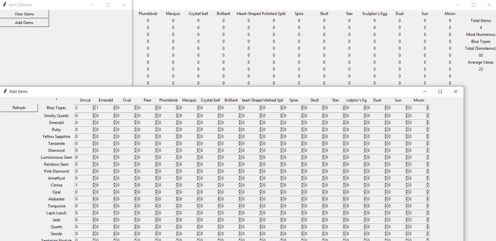

# Python - Sims 3 Assets
The Sims 3 had gems you could cut into various shapes. Rare gems and unusual cuts were worth more. This is a program to calculate the total value of your gem cuts depending on how many of each you have.

## Instructions
Click 'View Gems' to see how many of each gem cut you have. You can also view the number of gems, the most numerous gem, the estimated value of all gems in Simoleons and the average value.

Click 'Add Gems' to add gems to the database.

